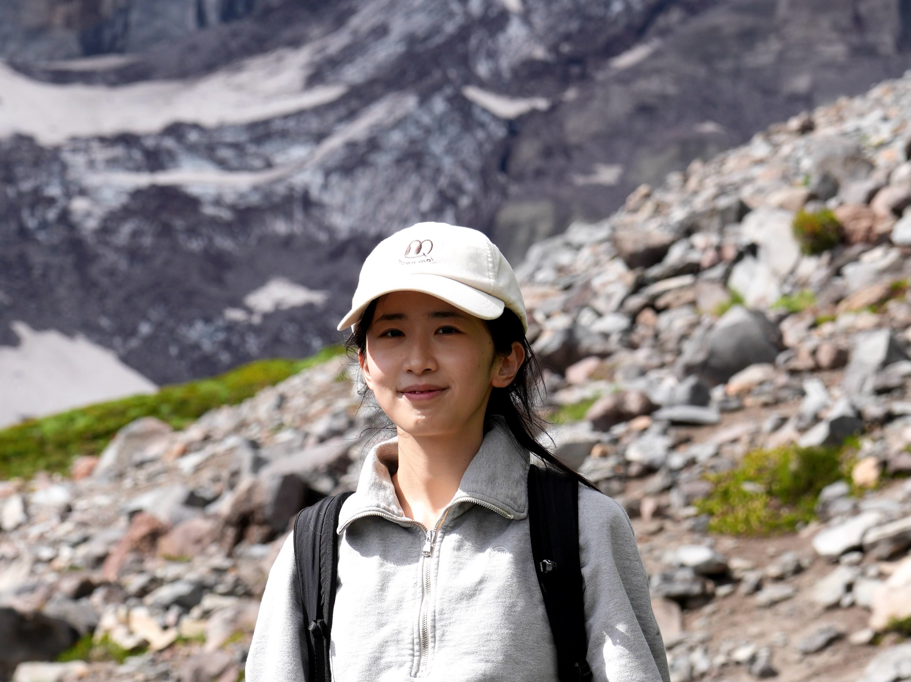

---
# Feel free to add content and custom Front Matter to this file.
# To modify the layout, see https://jekyllrb.com/docs/themes/#overriding-theme-defaults

layout: home
---

## About Me

I’m an incoming Assistant Professor at Columbia University in Computer Science. I recently earned my PhD at MIT EECS, advised by [Caroline Uhler](https://www.carolineuhler.com). My research focuses on establishing theoretical and algorithmic foundations for discovery and decision-making within systems created by underlying causal rules. In particular, I develop tools to understand causal relationships from data, model and extrapolate to predict the effects of interventions, and select informative interventions for experimental design. Motivated by problems in cell biology, these tools help accelerate and translate to biomedical discovery.

I was a research intern at [Bytedance](https://www.bytedance.com/en/resources/offices/5e429e0805204d81e5b45c92), [Microsoft Research](https://www.microsoft.com/en-us/research/project/project_azua/overview/), and [Apple](https://www.apple.com/careers/us/work-at-apple/seattle.html). I obtained my Bachelor’s degree in Mathematics from Peking University, where I worked with [Zaiwen Wen](http://faculty.bicmr.pku.edu.cn/~wenzw/), [Mengdi Wang](https://mwang.princeton.edu), and [Le Cong](http://clbiology.com/index.html). 

## News

- Aug., 2026. We organized the [Obesity Machine Learning Competition](https://www.ericandwendyschmidtcenter.org/ml-competitions/obesity-ml-competition) to tackle metabolic diseases, as the latest series within the [Cell Perturbation Prediction Challenge (CPPC)](https://www.ericandwendyschmidtcenter.org/flagship-projects#flagship-1).
- Apr., 2026. We organized the Causal Learning and Reasoning ([CLeaR](https://www.cclear.cc/2026)) 2026 conference at the Broad Institute of MIT and Harvard between April 6th to 8th. Check out the full agenda and contributions [here](https://www.cclear.cc/2026/FullAgenda)!
- Dec., 2025. We organized a NeurIPS2025 workshop on _[Uncovering Causality in Science (CauScien)](https://sites.google.com/view/causcien)_. Check out the talks and accepted papers. Follow our official X account [@CauScien](https://x.com/CauScien) for more updates from the growing community.
- Jul., 2025. We organized an ICML2025 workshop on _[Scaling up Intervention Models (SIM)](https://sites.google.com/view/sim-icml2025/home)_. Check out the talks and accepted papers.
- Jul., 2025. _[How to more efficiently study complex treatment interaction](https://news.mit.edu/2025/more-efficiently-studying-complex-treatment-interactions-0716)_: MIT news covered our [work](https://icml.cc/virtual/2025/poster/45285) on experimental design.
- Dec., 2024. Honored to receive the [Stuart L. Schreiber Awards in Scientific Excellence](https://www.ericandwendyschmidtcenter.org/updates/jiaqi-zhang-stuart-l-schreiber-award).
- Nov., 2024. _[A causal theory for studying the cause-and-effect relationships of genes](https://news.mit.edu/2024/causal-theory-studying-cause-and-effect-relationships-genes-1107)_: MIT news covered our [work](https://neurips.cc/virtual/2024/poster/95550) on causal theory.
- Oct., 2024. Happy to be selected for the [Rising Star in EECS 2024](https://risingstars-eecs.mit.edu/current-workshop/workshop-2024/) cohort. Learn more about the workshop [here](https://risingstars-eecs.mit.edu).
- Mar., 2024. Happy to present at [Women in Data Science (WiDS)](https://www.widscambridge.org/copy-of-wids-cambridge-2023) conference. Learn more about the conference [here](https://www.widscambridge.org).
- Oct., 2023. _[A more effective experimental design for engineering a cell into a new state](https://news.mit.edu/2023/more-effective-experimental-design-genome-regulation-1002)_: MIT news covered our [work](https://www.nature.com/articles/s42256-023-00719-0) on active learning in causal models. Read also on [EWSC news](https://www.ericandwendyschmidtcenter.org/updates/a-more-effective-experimental-design-for-engineering-a-cell-into-a-new-state).
- Mar., 2023. We hosted the [Cancer Immunotherapy Data Science Grand Challenge](https://www.topcoder.com/challenges/0494170d-3136-4139-89e0-6c1b009c66a2), as first within the [Cell Perturbation Prediction Challenge (CPPC)](https://www.ericandwendyschmidtcenter.org/flagship-projects#flagship-1). Read about the challenge [here](https://www.broadinstitute.org/news/machine-learning-experts-around-world-compete-improve-cancer-immunotherapy).

## Awards

- Stuart L. Schreiber Award in Scientific Excellence, Broad Institute (2024)
- Rising Stars in EECS (2024)
- Apple AI/ML PhD Fellowship (2023-2025)
- Eric and Wendy Schmidt Center PhD Fellowship (2022-2023)
- Member of National Mathematics Training Team of China (2016)
- Gold medal in CMO (2016)
- Rank 1st in Chinese Girls' Mathematics Olympics (2015)
